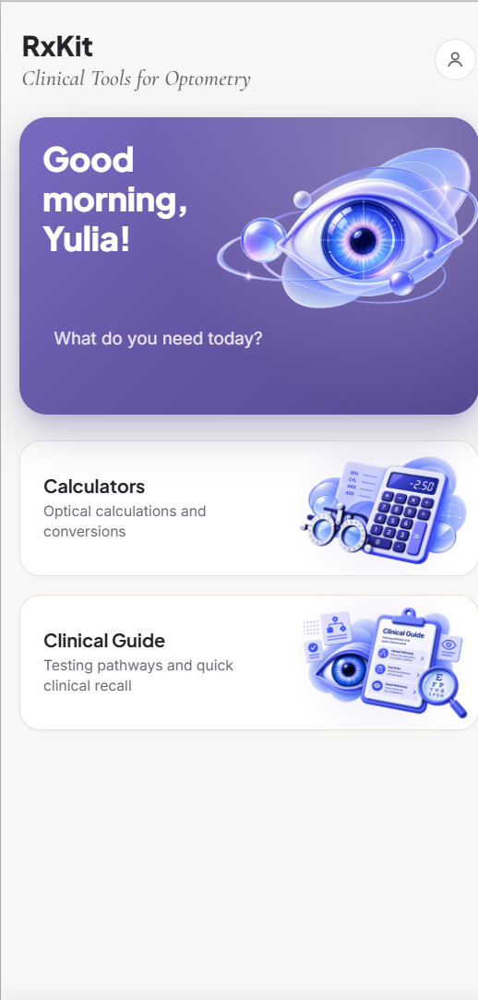
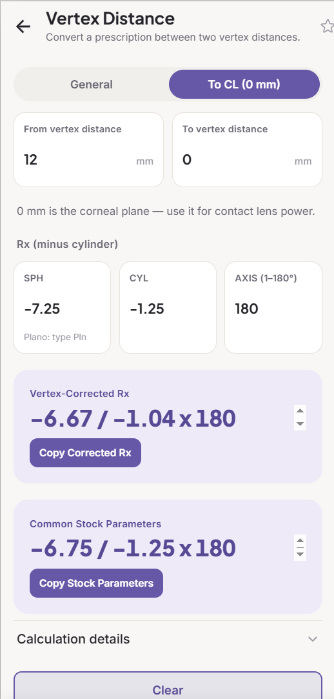
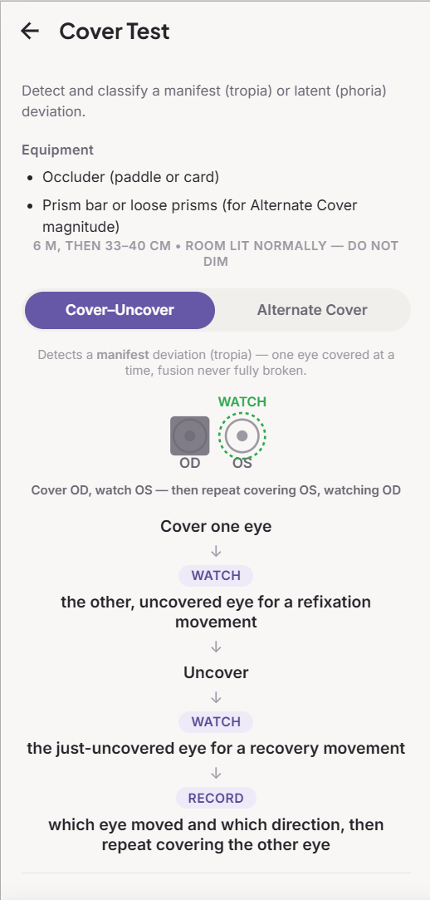

# RxVisus

**RxKit — Clinical Tools for Optometry**

A toolkit for opticians and optometrists — optical calculators and a
chairside clinical reference, designed to be opened many times a day
during real patient care. It's built by an optometrist who also writes
software, with a practicing optometrist as its first real user, and
every formula checked against clinical judgment before it ships.

  
  
  
  

---

## Why RxKit exists

A working optometrist reaching for something mid-exam is more likely to
reach for mental math, a paper cheat-sheet, or a half-remembered
textbook rule than for an app — that's the real baseline RxKit has to
beat. Two things follow from that: every calculator and reference card
needs to be reachable in two taps or fewer from launch, and every
formula and rounding convention has to hold up under real clinical
judgment before it ships, since a "close enough" calculator tends to
get trusted anyway (see [Clinical rigor](#clinical-rigor) below).

## What's inside

**Calculators** — form in, number out:

| Calculator | What it does |
|---|---|
| **Transposition** | Converts an Rx between plus- and minus-cylinder notation |
| **Working Distance → ADD** | Converts a test/working distance into the correct near addition |
| **Vertex Distance** | Exact vertex-corrected Rx and the nearest common stock lens parameters, shown separately |
| **Spherical Equivalent** | Sphere + ½ cylinder, with the same smart Rx-paste support as every other calculator |
| **Prism & Decentration** | Prism effect from decentration (Prentice's Rule) |

**Clinical Guide** — chairside recall and guided navigation:

- **Problem-first pathways** — start from a clinical question (*"patient
  has diplopia"*) and get routed branch by branch down to the relevant
  tests, with key steps and red flags along the way. Binocular Status,
  Diplopia, and Strabismus are built out so far.
- **Direct test lookup** — search or browse any of the 20+ canonical
  test cards (setup, how-to, what to watch for, how to record it,
  common mistakes). A test reached through a pathway and one reached by
  search are the same card — content isn't duplicated between the two.

**Across the app:**

- **Favorites** — pin any calculator or reference card as a shortcut,
  seeded from both modules.
- **Smart Rx paste** — paste a full prescription (`-2.00 / -1.25 x 90`,
  or the shorthand clinicians actually type) into any SPH/CYL/AXIS row
  and it fills all three fields at once.
- **Copy Result** on calculators where it's useful, for handing a
  number straight into an EHR or optical order.

## Design constraints

- **Offline and deterministic.** No AI, no LLM, no external APIs, no
  network calls. Every number comes from a pure, unit-tested function.
- **No patient-identifiable data.** No names, no patient IDs —
  numbers-only, local-only state (see [CLAUDE.md](CLAUDE.md)).
- **Installable, not just a website.** Ships as a real Android app
  (Capacitor, Google Play–bound, release signing already configured)
  and as an installable Progressive Web App for iOS/Safari and desktop,
  from one codebase.

## Clinical rigor

Every formula, threshold, and reference range is checked against a
named clinical source, and
[`docs/clinical/CLINICAL_SOURCES.md`](docs/clinical/CLINICAL_SOURCES.md)
tracks that process openly: each clinical claim carries one of five
statuses, from **✅ Verified against a named source** down to
**🔴 Needs source**, including the handful of places still flagged as
unvalidated starting points pending review by the app's real
optometrist user.

## Screenshots

  
  
  

## Tech stack

React + TypeScript, Ionic React (mobile UI/navigation), Capacitor (the
Android build and native platform APIs), Zustand for local state, Vite
for the build — with `vite-plugin-pwa` producing an installable,
offline-capable web build from the same codebase. Domain logic
(calculators, clinical reference data) is written as pure functions
with zero UI dependencies and is unit-tested with Vitest; end-to-end
flows are covered with Cypress. Full architecture, data model, and
working conventions are documented in [CLAUDE.md](CLAUDE.md).

## Status

**MVP in active development.** Calculators (Transposition, Working
Distance → ADD, Vertex Distance, Spherical Equivalent, Prism &
Decentration), Favorites, and the Clinical Guide architecture (seeded
with Binocular Status, Diplopia, and Strabismus) are implemented and
unit-tested. The app already runs as a native Android build and an
installable PWA. Most Clinical Guide content is still being written,
and clinical thresholds flagged in
[CLINICAL_SOURCES.md](docs/clinical/CLINICAL_SOURCES.md) are pending
final sign-off before release.

## Clinical disclaimer

RxKit is a clinical reference and decision-support tool for qualified
eye-care professionals — not a diagnostic device. It does not diagnose
patients or replace professional clinical judgment. It helps clinicians
measure, calculate, organize, and interpret clinical findings; the
clinician independently verifies all findings and remains responsible
for diagnosis, management, and treatment decisions.

This is surfaced in-app in two places: a required first-launch
acknowledgment (shown once, before the app can be used) and the About
page (Home's profile icon → **About RxKit**). See
[docs/legal/ACKNOWLEDGMENT_HISTORY.md](docs/legal/ACKNOWLEDGMENT_HISTORY.md)
for the acknowledgment's exact wording and version history.

## Documentation

- **[CLAUDE.md](CLAUDE.md)** — Tech stack, folder structure, data model,
  and working conventions.
- **[docs/design.md](docs/design.md)** — The product reasoning: what this
  has to beat, information architecture, MVP scope, and what's planned
  beyond it.
- **[docs/clinical/CLINICAL_SOURCES.md](docs/clinical/CLINICAL_SOURCES.md)**
  — Source-by-source audit of every clinical formula, threshold, and
  reference range implemented.
- **[docs/legal/ACKNOWLEDGMENT_HISTORY.md](docs/legal/ACKNOWLEDGMENT_HISTORY.md)**
  — Immutable version history of the first-launch clinical-use
  acknowledgment's exact wording.

## Note on the name

RxVisus is the repository and internal project name; the application is
presented to users as RxKit — Clinical Tools for Optometry.
