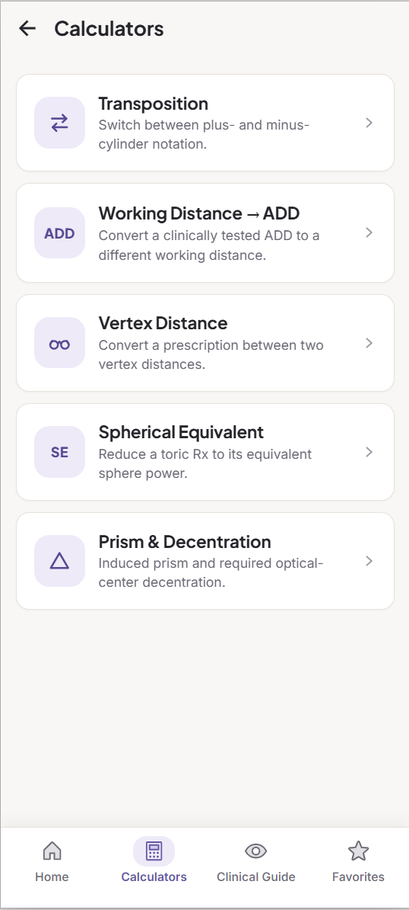
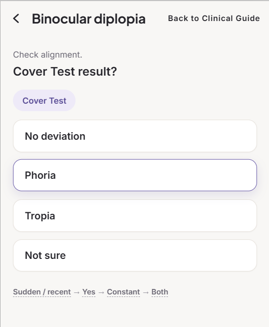

# RxKit

**Clinical Tools for Optometry**

A professional toolkit app for opticians and optometrists — fast optical
calculators and a chairside clinical reference, built to survive being
opened dozens of times a day in the middle of real patient care.

RxKit is not a student project dressed up as a product. It's built by
someone who works both sides of the problem — an optometrist who also
writes the software — for one real, identified user first, with every
formula checked against actual clinical judgment before it ships.

<p>
  
  
  
  
</p>

---

## Why RxKit exists

A working optometrist doesn't reach for an app — they reach for mental
math, a paper cheat-sheet, or a half-remembered textbook rule. That's the
real competition. So RxKit is built around two hard requirements most
"optical calculator" apps skip:

- **Speed beats features.** Every tool is reachable in two taps or fewer
  from launch — nothing is worth the app if it's slower than doing the
  math by hand.
- **Correctness isn't a quality bar, it's the entire value proposition.**
  A clinical calculator that's "close enough" is worse than no
  calculator at all, because it gets trusted and used anyway. Every
  formula and rounding convention here is checked against real clinical
  judgment before it ships — see
  [Clinical rigor](#clinical-rigor-not-just-claimed) below.

## What's inside

**Calculators** — form in, number out, fast:

| Calculator | What it does |
|---|---|
| **Transposition** | Converts an Rx between plus- and minus-cylinder notation |
| **Working Distance → ADD** | Converts a test/working distance into the correct near addition |
| **Vertex Distance** | Exact vertex-corrected Rx *and* the nearest common stock lens parameters, shown separately — never conflated |
| **Spherical Equivalent** | Sphere + ½ cylinder, with the same smart Rx-paste support as every other calculator |
| **Prism & Decentration** | Prism effect from decentration (Prentice's Rule) |

**Clinical Guide** — chairside recall and guided navigation, not a wall
of text:

- **Problem-first pathways** — start from a clinical question (*"patient
  has diplopia"*) and get routed through branch → branch → leaf down to
  the exact relevant tests, with key steps and red flags surfaced along
  the way. Binocular Status, Diplopia, and Strabismus are built out today.
- **Direct test lookup** — search or browse straight to any of the 20+
  canonical test cards (setup, how-to, what to watch for, how to record
  it, common mistakes). A test reached via a pathway and one reached by
  search land on the exact same card — content is never duplicated
  between the two.

**Everywhere in the app:**

- **Favorites** — pin any calculator or reference card as a one-tap
  shortcut, seeded from both modules.
- **Smart Rx paste** — paste a full prescription (`-2.00 / -1.25 x 90`,
  or the space-separated shorthand clinicians actually type) into any
  SPH/CYL/AXIS row and it fills all three fields at once, instead of
  dumping the whole string into one box.
- **Copy Result** on every calculator where it matters, one tap, with
  visible copied-feedback — built for handing a number straight into an
  EHR or optical order, not for retyping it.

## Built for the way a clinic actually works

- **Fully offline, fully deterministic.** No AI, no LLM, no external
  APIs, no network calls, no recurring costs. Every number RxKit shows
  comes from a pure, unit-tested function — not a model's best guess.
- **Never stores patient-identifiable information.** No names, no patient
  IDs — numbers-only, local-only state. That's a deliberate design
  constraint, not an oversight (see [CLAUDE.md](CLAUDE.md)).
- **One real user, from day one.** Every formula and rounding convention
  is validated against a practicing optometrist's judgment before it
  ships — this produces numbers used in real patient care, so "looks
  right" isn't good enough.
- **Installable app, not just a website.** Ships as a real installable
  Android app (Capacitor, Google Play–bound, release signing already
  configured) **and** as an installable Progressive Web App for
  iOS/Safari and desktop — one codebase, no separate web build to
  maintain.

## Clinical rigor, not just claimed

Every formula, threshold, and reference range in RxKit is checked
against a named, citable clinical source — and where one wasn't found,
the app says so instead of quietly guessing.
[`docs/clinical/CLINICAL_SOURCES.md`](docs/clinical/CLINICAL_SOURCES.md)
is a running, honest audit of that process: each clinical claim gets one
of five explicit statuses, from **✅ Verified against a named source**
down to **🔴 Needs source** — including the handful of places where the
implementation is still flagged as an unvalidated starting point pending
review by the app's real optometrist user. That level of candor about
what *isn't* proven yet is exactly what makes the "✅ Verified" claims
worth trusting.

## Screenshots

The repo doesn't yet contain real captures of the running app — only an
early visual-design reference used to lock down the brand's color
palette, type, and layout language before build (not a screenshot of
current UI, and some on-screen copy has since changed). Once you have a
debug build or emulator running, this is the highest-leverage thing you
can add to this README. Recommended set — **5 screens**, arranged as one
row of phone-frame images under this heading:

1. **Home** — the "several times a day" entry point; sells the calm,
   uncluttered first impression.
2. **Calculators list** — shows the breadth of tools at a glance.
3. **Vertex Distance result** — the single best "this is real clinical
   software" screen: exact Rx and stock-lens parameters shown separately,
   with the outside-stock-range notice visible if you trigger it.
4. **Clinical Guide pathway** (e.g. Diplopia → a branch screen) — sells
   the problem-first navigation idea in one glance.
5. **A Test Card** (e.g. Double Maddox Rod) — sells the depth/quality of
   the reference content itself.

Export at actual device resolution (or a consistent phone-frame mockup),
drop them in `docs/screenshots/`, and reference them here as:

```md
<p>
  
  
  
  
  
</p>
```

## Tech stack

React + TypeScript, Ionic React (native-feeling mobile UI/navigation),
Capacitor (real installable Android app + native platform APIs), Zustand
for local state, Vite for the build — with `vite-plugin-pwa` producing an
installable, offline-capable web build from the same codebase. Domain
logic (calculators, clinical reference data) is written as pure
functions with zero UI dependencies and is unit-tested with Vitest;
end-to-end flows are covered with Cypress. Full architecture, data model,
and working conventions are documented in [CLAUDE.md](CLAUDE.md).

## Status

**MVP in active development.** Calculators (Transposition, Working
Distance → ADD, Vertex Distance, Spherical Equivalent, Prism &
Decentration), Favorites, and the Clinical Guide architecture (seeded
with Binocular Status, Diplopia, and Strabismus) are implemented and
unit-tested. The app already runs as a native Android build and an
installable PWA. Most Clinical Guide content is still being written, and
clinical thresholds flagged in
[CLINICAL_SOURCES.md](docs/clinical/CLINICAL_SOURCES.md) are pending
final sign-off before release.

## Clinical disclaimer

RxKit is a clinical reference and decision-support tool for qualified
eye-care professionals — not a diagnostic device. It does not diagnose
patients or replace professional clinical judgment. It helps clinicians
measure, calculate, organize, and interpret clinical findings; the
clinician independently verifies all findings and remains responsible
for diagnosis, management, and treatment decisions.

This is surfaced in-app in two places: a required first-launch
acknowledgment (shown once, before the app can be used) and the About
page (Home's profile icon → **About RxKit**). See
[docs/legal/ACKNOWLEDGMENT_HISTORY.md](docs/legal/ACKNOWLEDGMENT_HISTORY.md)
for the acknowledgment's exact wording and version history.

## Documentation

- **[CLAUDE.md](CLAUDE.md)** — Tech stack, folder structure, data model,
  and working conventions.
- **[docs/design.md](docs/design.md)** — The product reasoning: what this
  has to beat, information architecture, MVP scope, and what's planned
  beyond it.
- **[docs/clinical/CLINICAL_SOURCES.md](docs/clinical/CLINICAL_SOURCES.md)**
  — Source-by-source audit of every clinical formula, threshold, and
  reference range implemented.
- **[docs/legal/ACKNOWLEDGMENT_HISTORY.md](docs/legal/ACKNOWLEDGMENT_HISTORY.md)**
  — Immutable version history of the first-launch clinical-use
  acknowledgment's exact wording.

## Note on the name

The product's user-facing brand is **RxKit** — "*RxKit — Clinical Tools
for Optometry*" is the full presentation; UI surfaces show the short
form (`RxKit`) with the tagline reserved for onboarding/install/About-
style brand surfaces.

**The repository and internal project name are independent of the
product brand and are not being renamed.** The codebase, package name,
Capacitor `appId`, and local-storage key namespace all still use the
project's earlier working name (`rxvisus`) — that's a technical/internal
identifier, not the product people see, so there's no reason to touch
it just because the brand changed. If you're looking for the earlier
naming history: this project went through two working names before
landing on the final brand — `OptoBench`, then `RxVisus` (chosen partly
because "RxKit" collided with ReactiveX libraries in software search
results at the time) — before "RxKit" was confirmed as the final
product name regardless of that collision.
